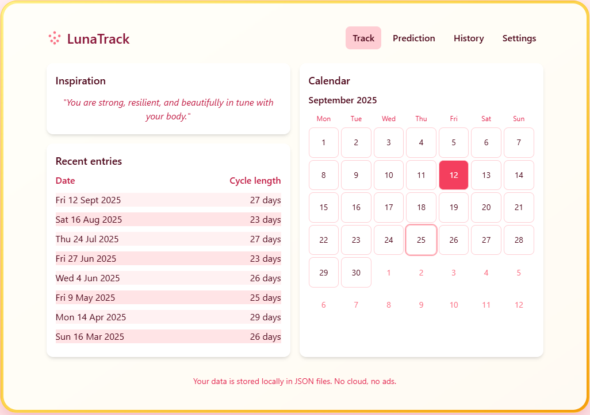
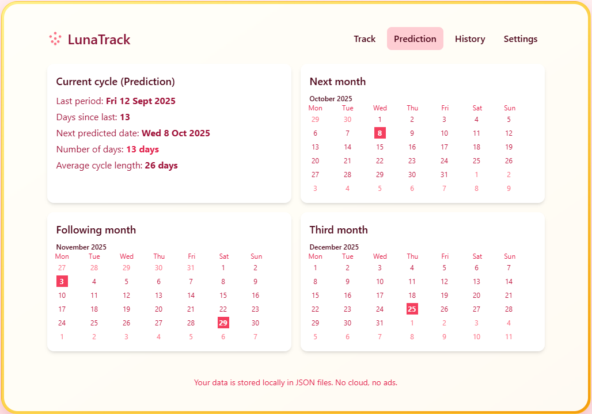
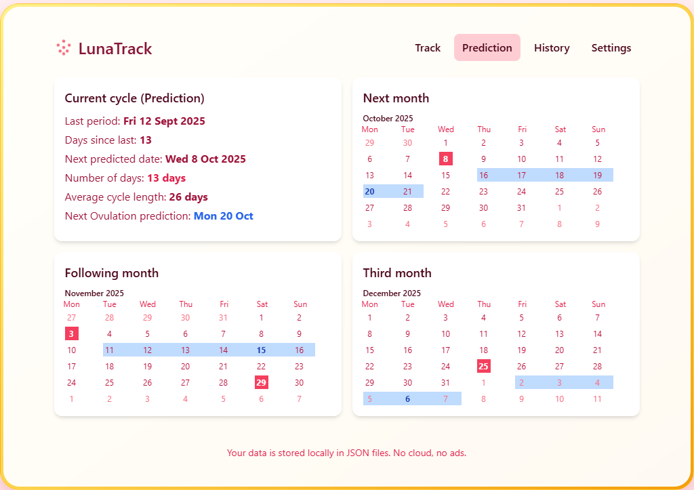
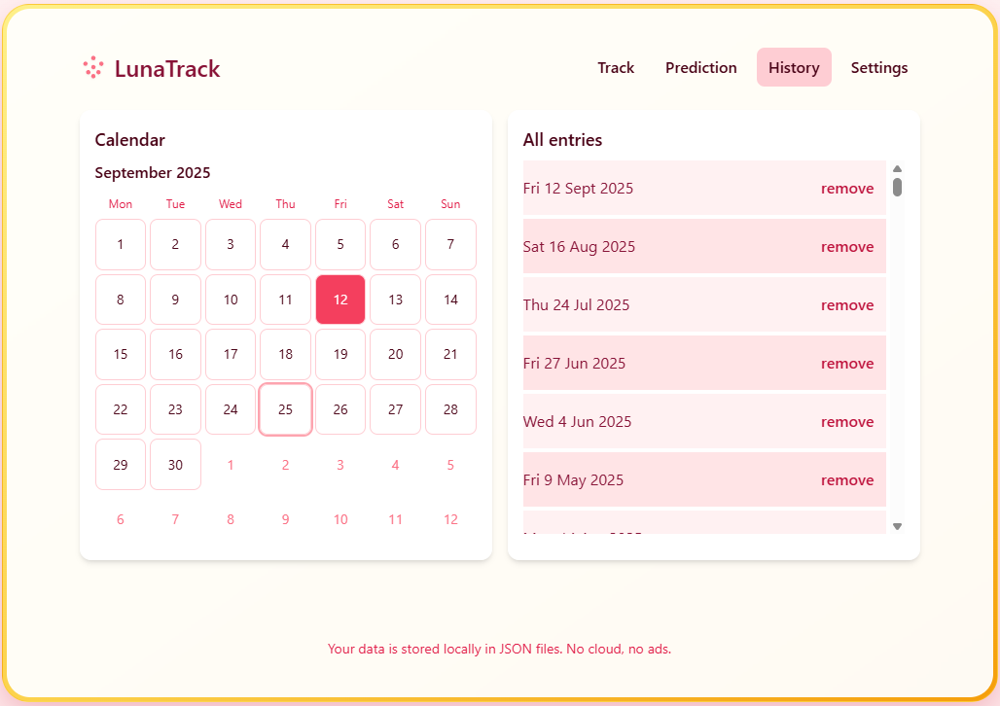
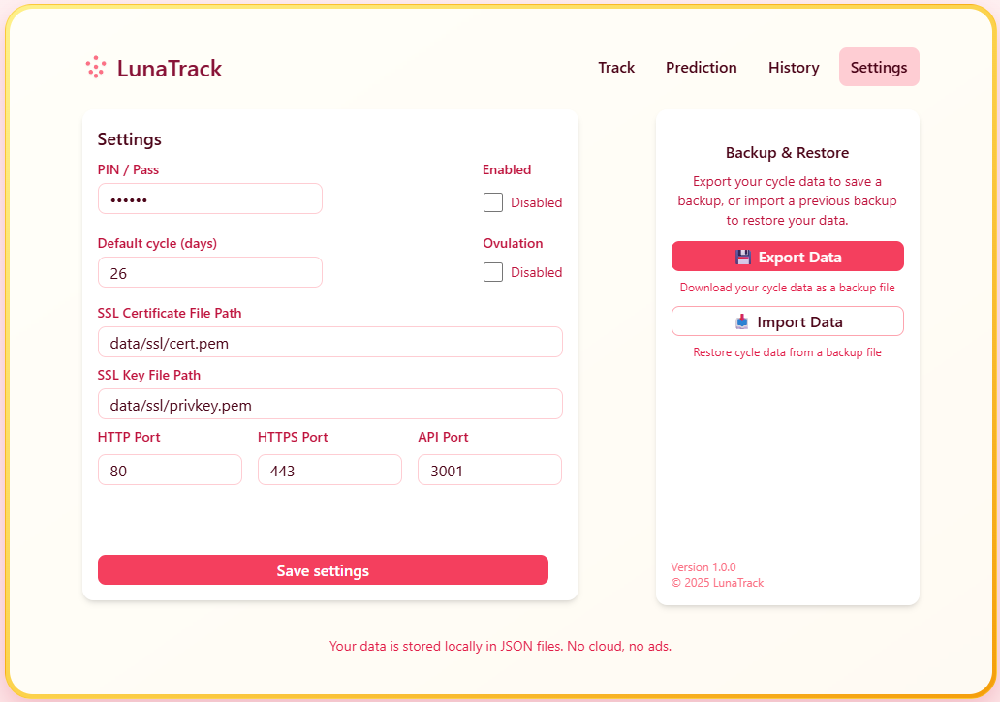

# LunaTrack (Period & Cycle Tracker)

A simple, pretty, privacy-first period tracker. Choose dates on a calendar, see past entries, current cycle status, an estimate for the next period, and future predictions based on your average cycle length. Settings like username and data filename are stored locally.

About this version
------------------
This repository implements LunaTrack, a small local-first period & cycle tracker intended to run on your machine. This version includes a full frontend (React + Vite) and a lightweight backend (Express) that persist data to JSON files under the `data/` folder. It focuses on privacy, simplicity, and developer-friendly local runs.

Key functionality included in this release:
- Calendar UI to add and remove period start dates and inspect past entries.
- Cycle statistics: days since last period, average cycle length, and next-period estimates with simple projections.
- Settings UI and API for configuring username, data filename, default cycle length, and privacy options.
- Network configuration exposed via settings and API: HTTP/HTTPS ports, API port, and SSL paths (for dev HTTPS mode).
- Backup and restore endpoints that export/import both settings and entry data in a single JSON payload.
- A small REST API for programmatic access to entries, settings, and health checks (see API Endpoints section).
- Dev scripts to run the frontend and backend together in HTTP or HTTPS mode (ports and SSL are read from `data/settings.json`).
- Local JSON storage only — no external network calls or telemetry by default.

## Screenshots
A few example screenshots from this build (open in a Markdown viewer to see them inline). Files are in the `screenshots/` folder.











## Tech Stack
- Frontend: React + Vite + TypeScript + Tailwind CSS
- Backend: Node.js + Express
- Storage: JSON files on disk (no database)

## Dev Quickstart
- Install deps
- Start backend and frontend in dev mode
- The app will be available on http://localhost:5173 and backend on http://localhost:3001

See detailed commands at the bottom.

## Features
- Calendar to add/remove period start dates
- Past entries list
- Current cycle stats: days since last period, average cycle length
- Next period estimate and a few future projections
- Settings: username, data filename, default cycle length (override)
- Local JSON persistence (no cloud)

## Project Structure
```
client/   # Vite React TS frontend
server/   # Express backend, json-file storage
```

## Privacy
Your data lives on your machine in simple JSON files. No remote servers or telemetry.

## License
MIT

---

## Try it
Quick commands to get the full dev environment running.

Install everything (server + client):
- `npm run install:all`

Run in development (both server and client together):
- HTTP (dev servers use ports from `data/settings.json`): `npm run dev:http`
- HTTPS (dev servers use SSL from `data/settings.json`): `npm run dev:https`

Default settings.json
----------------------
The app reads its configuration from `data/settings.json` (relative to the project root). If the file is missing you can create it yourself before the first run. An example default you can copy into `data/settings.json`:

```json
{
	"pin": "000000",
	"pinEnabled": false,
	"dataFile": "cycles.json",
	"defaultCycleLength": 27,
	"fileProtected": true,
	"SSL": {
		"certFile": "data/ssl/cert.pem",
		"keyFile": "data/ssl/privkey.pem"
	},
	"httpPort": 5173,
	"httpsPort": 443,
	"apiPort": 3001,
	"enableOvulation": true
}
```

Location notes:
- Relative path: `data/settings.json` (recommended)
- Absolute example (on your machine): `<project-root>/data/settings.json` — e.g. `/home/<home>/Dev/<project-root>/data/settings.json`

When you modify `apiPort`, SSL file paths, or other server-facing settings, restart the backend for changes to take effect.

You can also run each side individually:
- Backend only: `npm --prefix server run dev:http` or `npm --prefix server run dev:https`
- Frontend only: `npm --prefix client run dev:http` or `npm --prefix client run dev:https`

Notes:
- The client dev server proxies `/api` to the API server; make sure the API server is started on the configured `apiPort` in `data/settings.json`.
- HTTPS mode requires SSL files configured in `data/settings.json` (or Vite will fall back to a self-signed cert).

## API Endpoints

### Health
- `GET /api/health` — Returns `{ ok: true }` if the server is running.

### Settings
- `GET /api/settings` — Get current app settings.
- `PUT /api/settings` — Update app settings. Expects JSON body matching settings schema.
- `GET /api/file-protected` — returns { fileProtected: true|false }
- `PUT /api/file-protected` — set fileProtected by sending { fileProtected: true|false }
- `GET /api/enable-ovulation` — returns { enableOvulation: true|false }.
- `PUT /api/enable-ovulation` — accepts { enableOvulation: true|false }

### Network
- `GET /api/ports` — returns the current HTTP and HTTPS ports.
- `PUT /api/ports` — updates both ports (expects { httpPort, httpsPort } as numbers)
- `GET /api/ssl` — returns the SSL config from settings.
- `PUT /api/ssl` — updates the SSL config in settings (validates certFile and keyFile as strings)
- `GET /api/api-port` — returns { apiPort: number }
- `PUT /api/api-port` — accepts { apiPort: number }, validates it's an integer 1–65535, writes to settings.json, and returns { apiPort }.

### Entries
- `GET /api/entries` — Get all period entries and stats (cycle length, predictions, etc).
- `POST /api/entries` — Add a new entry. Expects `{ date: 'YYYY-MM-DD' }` in JSON body.
- `DELETE /api/entries/:date` — Remove an entry by date (format: `YYYY-MM-DD`).


### Backup & Restore
- `GET /api/backup` — returns { settings, entries } where entries are read from the file named in settings.dataFile.
- `POST /api/restore` — accepts { settings, entries }, validates them, writes settings.json and writes entries into the file named by the restored

### Inspiration
- `GET /api/inspiration/:id` — Get a single inspiration message by id (1–60). Returns `{ id, message }`.

---
All endpoints return JSON. For more details, see `server/src/index.ts`.


